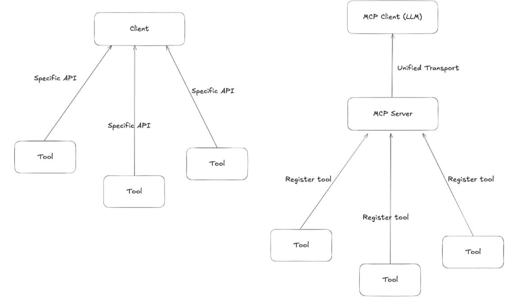
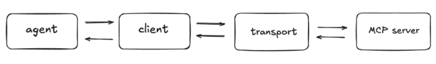
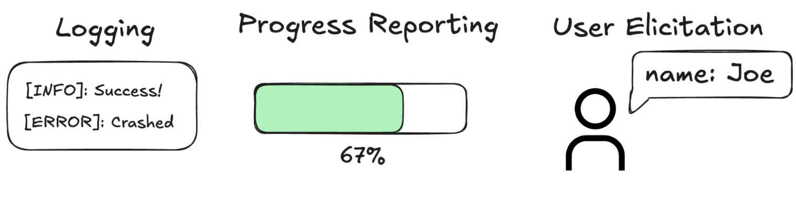

# MCP Labs

A collection of small Python experiments for learning the Model Context Protocol
(MCP). The examples move from a simple FastMCP server to clients that discover
tools, call local and remote servers, connect several MCP servers to one agent,
and expose richer server features such as resources, prompts, progress
notifications, logging, and user elicitation.

## What I learned

### 1. MCP gives tools a common interface

Without MCP, an application usually needs a different integration for every
tool or service. With MCP, a server registers capabilities and an MCP client
discovers and uses them through the protocol.

The basic flow in this repository is:

An MCP server can expose three important kinds of capabilities:

- **Tools** perform actions, such as adding numbers or writing a file.
- **Resources** expose readable data, such as a file or directory listing.
- **Prompts** provide reusable prompt templates for an LLM workflow.

### 2. FastMCP makes server registration small

`stdio_server.py` creates a `FastMCP` server and registers two tools with
`@mcp.tool`: `add` and `subtract`. Their Python type annotations and docstrings
describe the inputs and outputs that clients discover.

The same server also demonstrates a resource and a prompt:

- `file://endpoint2/{name}` reads a document from the `path` directory.
- `review_code` creates a code-review prompt.

`client_stdio_server.py` imports that server directly and calls both calculator
tools without starting a separate process. This is useful for understanding the
smallest possible local client/server example.

### 3. Transports determine how the client reaches the server

This repository demonstrates three connection styles:

- **In-process:** `client_stdio_server.py` passes the imported `mcp` object to
	`fastmcp.Client`.
- **Stdio:** `llama_client_local.py` starts `stdio_server.py` as a child process.
	The server and client exchange MCP messages over standard input/output.
- **Streamable HTTP:** `remote_mcp.py` connects to Context7 at
	`https://mcp.context7.com/mcp`

### 4. MCP tools can be given to an LLM agent

The LLM examples use LangChain's MCP adapter to load discovered MCP tools into a
LangChain agent. `ChatOllama` supplies a local Qwen model, so the model can decide
when to call `add` and then explain the result.

`multiple_mcp_server.py` uses `MultiServerMCPClient` to combine tools from:

- the local stdio server, and
- an HTTP server at `http://127.0.0.1:8000/mcp`.

The agent receives one unified tool collection even though the tools come from
different servers and transports.

## Enhanced MCP server

The `enhanced-mcp-server` directory is a more complete example. Its server is a
file-operations MCP server with the following capabilities:

### Tools

- `write_file(file_path, content, ctx)` creates a file and reports write
	progress through the MCP context.
- `delete_file(file_path, ctx)` deletes files and reports missing files or
	directory paths without deleting directories.

### Resources

- `file:///{file_name}` returns file content as structured data.
- `dir://.` returns directory entries with names, paths, types, sizes, and
	timestamps.

### Prompts

- `code_review(file_path, ctx)` reads a file and creates a code-review prompt.
- `documentation_generator(ctx)` uses elicitation to ask for a source file and
	documentation filename, then creates a documentation-generation prompt.

The enhanced client (`enhanced-mcp-server/client.py`) demonstrates more of the
MCP lifecycle:

- discovers server tools and loads them into a LangChain agent;
- displays tool calls, tool results, and agent messages;
- handles progress, informational, warning, and error notifications;
- handles server requests for user input through elicitation;
- reads files and directory listings through resources; and
- lets the user run prompts or chat with the local Qwen agent from a menu.

